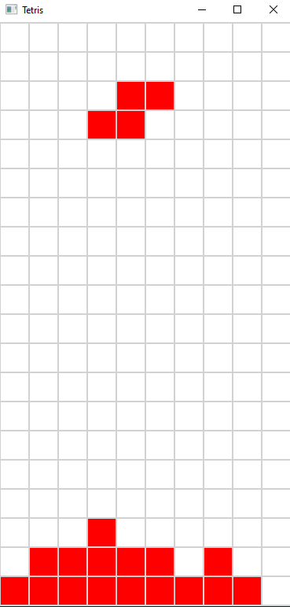

# Tetris
Tetris in c++

## Dependencies
If you use Linux, install SFML's dependencies using your system package manager. On Ubuntu and other Debian-based distributions you can use the following commands:

```
sudo apt update
sudo apt install \
    libxrandr-dev \
    libxcursor-dev \
    libxi-dev \
    libudev-dev \
    libfreetype-dev \
    libflac-dev \
    libvorbis-dev \
    libgl1-mesa-dev \
    libegl1-mesa-dev \
    libfreetype-dev
```

## Build

```
cmake -B build -S . -DCMAKE_BUILD_TYPE=Release
cmake --build build
```

## Run

```
./build/bin/Tetris
```

